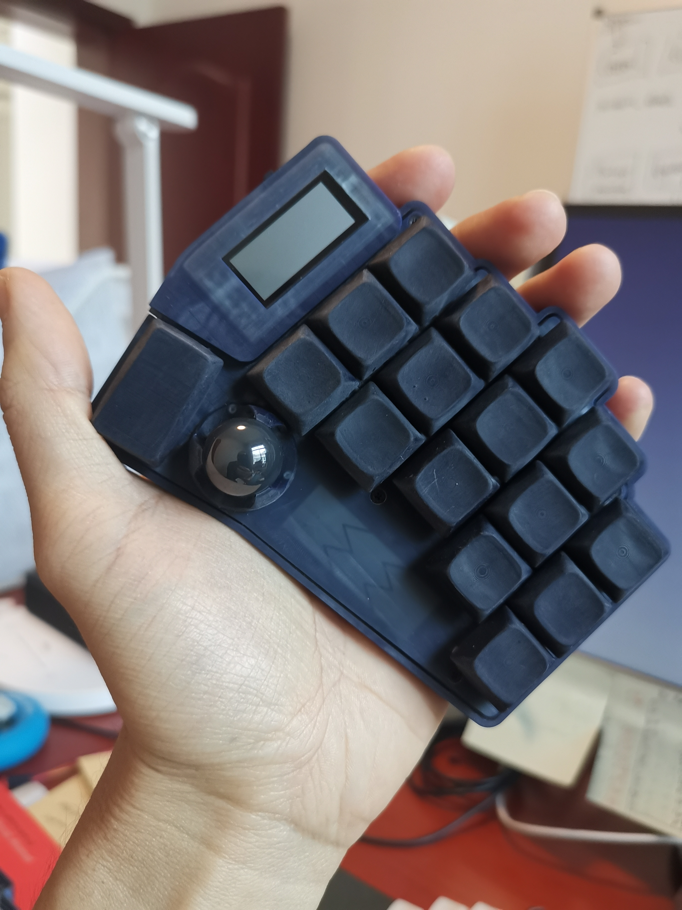
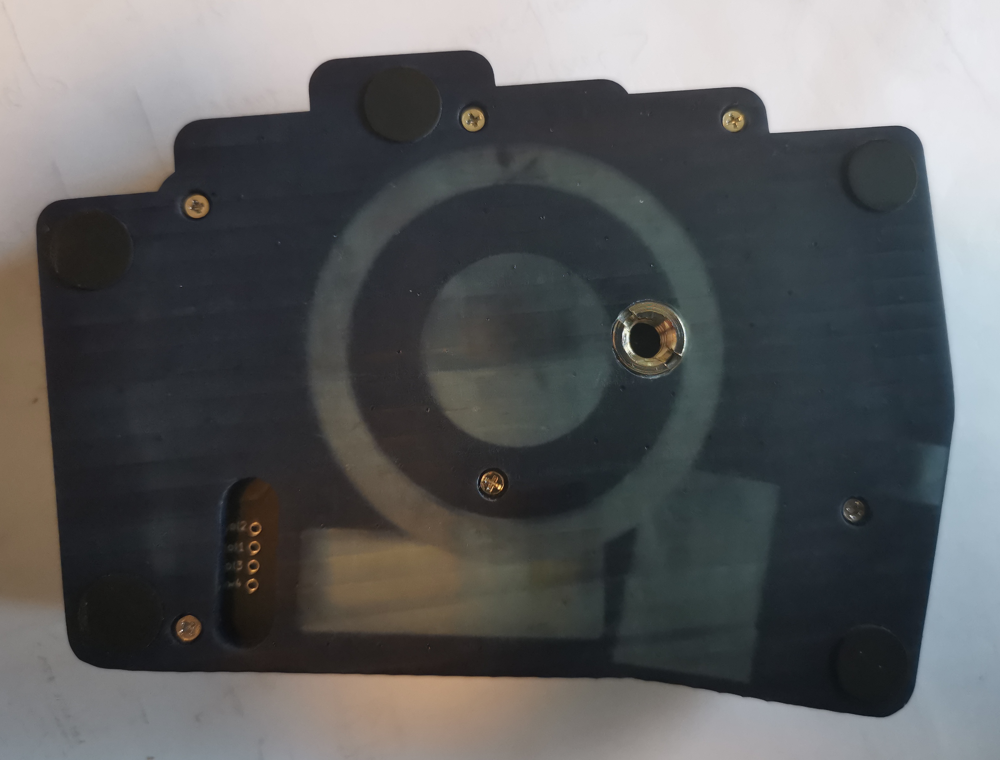

# A collection of designed keyboards #
## Features
All keyboards are powered by [zmk](https://zmk.dev/) with following design goals:
- portability
- minimalism
- ergonomic
- yet still powerful

## Super-powerful trackball firmware
- [youtube trackball demo](https://www.youtube.com/watch?v=7J-NTVMHwWQ&t=86s)
- [pmw3610_breakout pcb](https://github.com/ufan/pmw3610_breakout)
- [firmware support](https://github.com/ufan/zmk/tree/ptdevice-refactor)

# 42-key classic Corne-Pro with EPD display

# 34-key Sweep-Pro with horizontal encoders

# 32-key Blade with a mini-trackball and a touchbar

# Customizable logo display

# Wireless charging option

# Tenting support

# Extensible

# 3D-printed concave/convex keycaps

